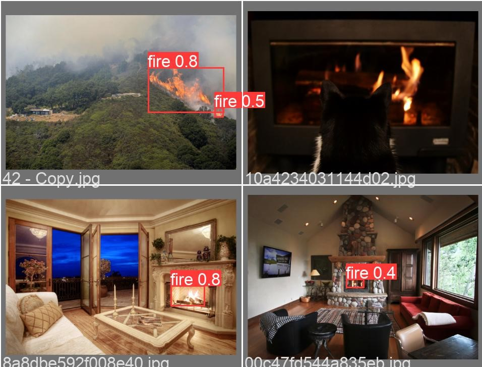

# fire_detection_yolo
custom YOLO model which will can be used to detect fire, this is complete end to end to project in which web based flask API is been used to streamline the fire detection system with notification intregation with email using SMTP client. It support direct https stream, webcam, videos, images, frame. Please follow the steps to get the setups running.
The top level dependencies are listed in pip_install.
# How to run the model
# step to follow
```
git clone https://github.com/faisal-alam1342/fire_detection_yolo.git
```
```
cd fire_detection_yolo/deployment
```
Install pip package manager on your system
for windows --> Follow this https://www.youtube.com/watch?v=1mn-vA5l_90
for linux/unix --> directly install from default or preferred package manager
# create an env (optional)
```
conda create --name new_env python
```
note: will recommend using virutal env for no dependencies conflict
# pip install all the dependecies
pip install -r pip_install.txt
# Run directly from terminal (sample commands for input types)
(image)
```
python run_model.py --source testing/test_image.png --weights ../models/trained_model.pt --conf 0.2 --email_off
```
(video)
```
python run_model.py --source testing/input.mp4 --weights ../models/trained_model.pt --conf 0.2 --email_off
```
(webcam)
```
python run_model.py --source 0 --weights ../models/trained_model.pt --conf 0.2 --email_off
```
(http stream/ webcam stream)
```
python run_model.py --source {http_link_here} --weights ../models/trained_model.pt --conf 0.2 --email_off
```
note: --conf is confidence, please notice the --email_off flag is there which will turn off email notification if one wants email notification, replace --email_off with --email yourmail@mail.com

# Run Through the flask API (GUI web application)
python app.py

now open http://localhost:5000/
it will open a gui web window like this


*Note: The email cleint is by default is turned on the GUI application


# Additional information
#### Training
I set up ```train.ipynb``` script for training the model from scratch. To train the model, download [Fire-Dataset](https://drive.google.com/file/d/1TQKA9nzo0BVwtmojmSusDt5j02KWzIu9/view?usp=sharing) and put it in ```datasets``` folder. This dataset contains samples from both [Fire & Smoke](https://www.kaggle.com/dataclusterlabs/fire-and-smoke-dataset) and [Fire & Guns](https://www.kaggle.com/atulyakumar98/fire-and-gun-dataset) datasets on Kaggle. I filtered out images and annotations that contain smokes & guns as well as images with low resolution, and then changed fire annotation's label in annotation files.
```
python train.py --img 640 --batch 16 --epochs 10 --data ../fire_config.yaml --weights yolov5s.pt --workers 0
```
#### Prediction
If you train your own model, use the following command for detection:
```
python detect.py --source testing/input.mp4 --weights runs/train/exp/weights/your_model.pt --conf 0.2
```
Or you can use the pretrained model located in ```models``` folder for detection as follows:
```
python detect.py --source testing/input.mp4 --weights ../models/trained_model.pt --conf 0.2
```

## Results
The following charts were produced after training YOLOv5s with input size 640x640 on the fire dataset for 10 epochs.

| P Curve | PR Curve | R Curve |
| :-: | :-: | :-: |
|  |  |  |

#### Prediction Results
The fire detection results were fairly good even though the model was trained only for a few epochs. However, I observed that the trained model tends to predict red emergency light on top of police car as fire. It might be due to the fact that the training dataset contains only a few hundreds of negative samples. We may fix such problem and further improve the performance of the model by adding images with non-labeled fire objects as negative samples. The [authors](https://github.com/ultralytics/yolov5/wiki/Tips-for-Best-Training-Results) who created YOLOv5 recommend using about 0-10% background images to help reduce false positives. 


| Ground Truth | Prediction | 
| :-: | :-: |
|  |  |
|  |  | 

#### Feature Visualization
It is desirable for AI engineers to know what happens under the hood of object detection models. Visualizing features in deep learning models can help us a little bit understand how they make predictions. In YOLOv5, we can visualize features using ```--visualize``` argument as follows:

```
python detect.py --weights runs/train/exp/weights/your_model.pt --img 640 --conf 0.2 --source ../datasets/fire/val/images/0.jpg --visualize
```

| Input | Feature Maps | 
| :-: | :-: |
|  |  |

## Reference
[YOLOv5-Custom-Training.ipynb](https://github.com/ultralytics/yolov5/wiki/Train-Custom-Data) script for training YOLOv5 model on the fire dataset. For more information on training YOLOv5, please refer to its homepage.
* https://github.com/robmarkcole/fire-detection-from-images
* https://github.com/ultralytics/yolov5
* https://github.com/AlexeyAB/darknet

